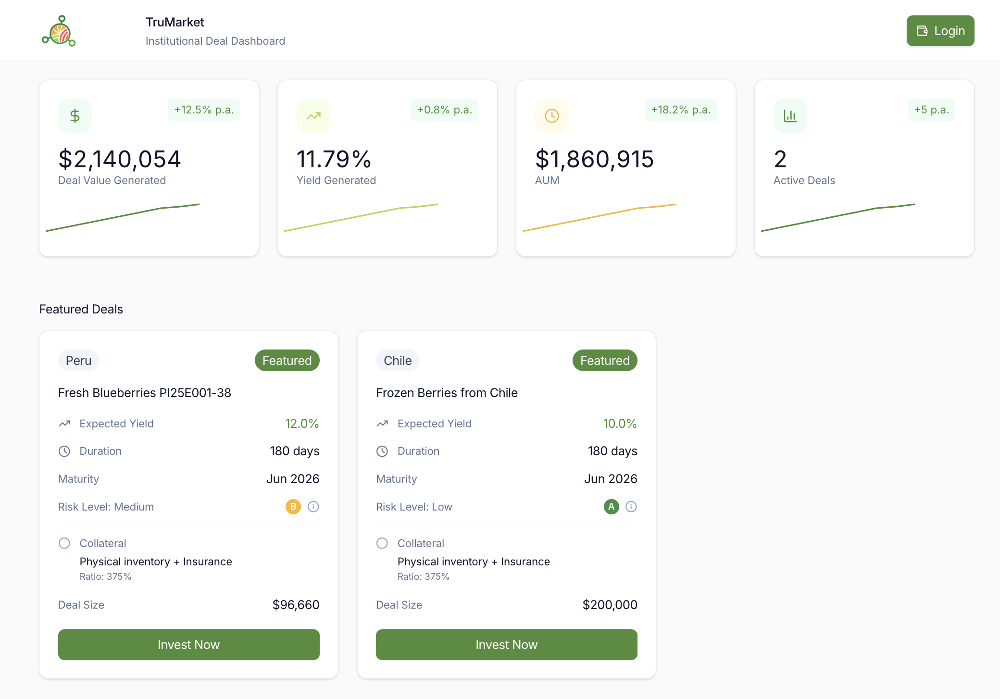
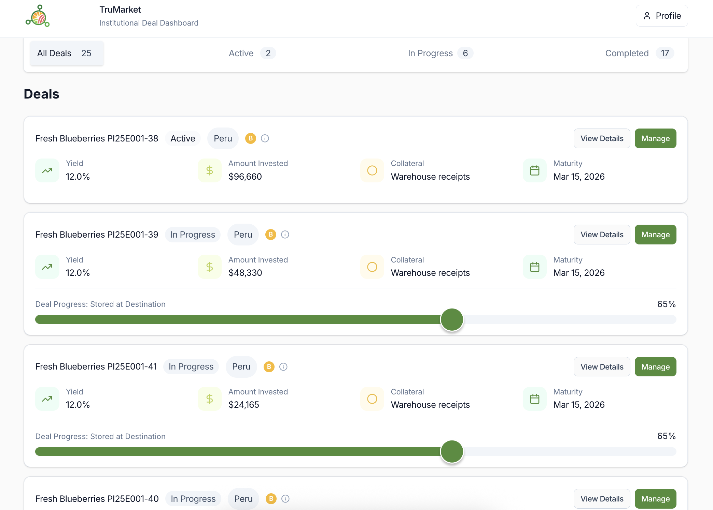
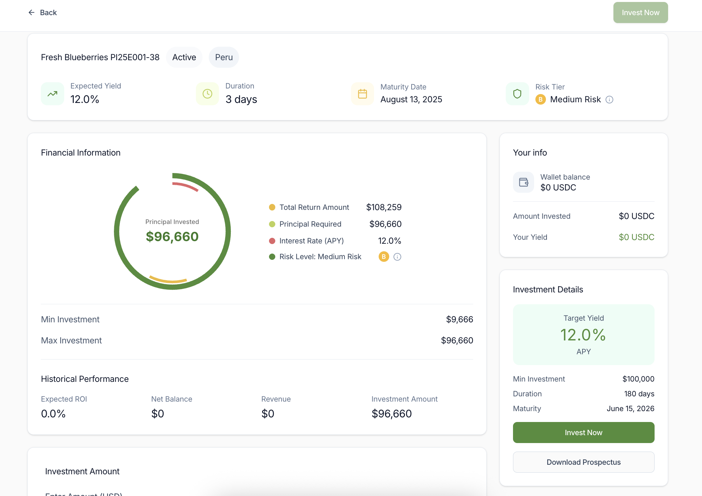
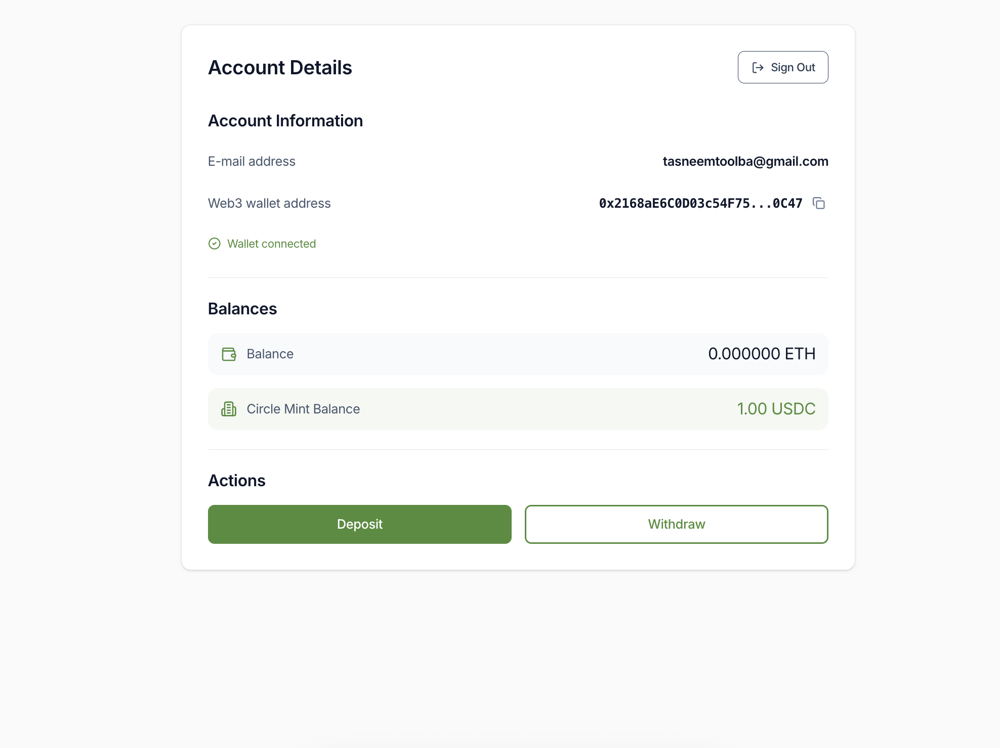
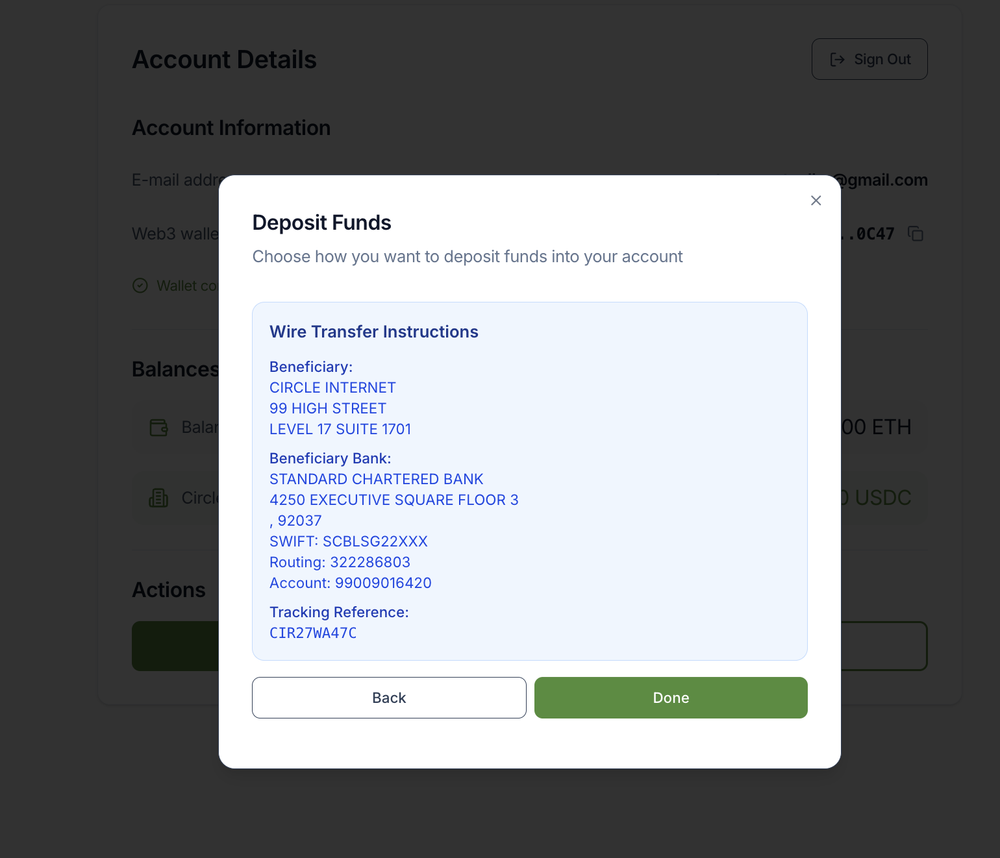

# TruMarket Investor Platform

The TruMarket Investor Platform is the investor-facing application of TruMarket. It allows investors to fund real trade finance deals, track performance, and withdraw returns once deals are completed.

The platform is designed to be clear and financial-first. Investors interact with capital allocation and portfolio tracking, while deal execution, milestone logic, and settlement are handled by TruMarket’s backend infrastructure.

Live application: https://finance.trumarket.tech  
Demo video: https://www.loom.com/share/76d6496f2dd04cbc92761a6355bdba08

---

## How it works

1. **Account access**  
   Investors create an account or log in to an existing one on the platform.

2. **Add funds**  
   Funds can be added to the investor wallet using:
   - Direct stablecoin transfer to the wallet address  
   - Fiat on-ramp via Circle Mint

3. **Browse deals**  
   Investors can view available deals, including:
   - Deal and shipment details  
   - Risk level  
   - Expected APY  
   - Deal duration and current status

4. **Invest**  
   Investors select a deal and allocate capital. Funds are deposited into a deal-specific vault.

5. **Track performance**  
   While the deal is active, investors can track:
   - Invested amount  
   - Daily yield generation  
   - Deal progress

6. **Withdraw returns**  
   After the deal is completed, investors can withdraw:
   - Their original investment  
   - The generated yield based on the deal APY

---

## Platform preview

The images below show the main investor flows. Replace with updated screenshots if needed.

  
  
  



---

## How this fits into TruMarket

TruMarket funds real export shipments using milestone-based payouts.

- Investors provide capital through this platform  
- Funds are allocated into deal vaults  
- Capital is released as shipment milestones are completed  
- Returns are distributed once the deal finishes  

This platform focuses on capital allocation, visibility, and returns, while operational workflows are handled off-platform.

---

## Tech stack

- React with TypeScript  
- ethers.js for Web3 interactions  
- MetaMask and injected wallet providers  
- TruMarket internal APIs  
- Vercel for deployment  

---

## Local development

### Requirements

- Node.js 18 or later  
- npm or yarn  
- A Web3 wallet such as MetaMask  

### Setup

```bash
git clone https://github.com/AgroSmart-Contracts/trumarket-finance-next.git

npm install
npm run dev
```

### The application will be available at:

```bash
http://localhost:3000
```

### Environment variables

This repository includes a .env.example file.

To configure your local environment:

```bash
cp .env.example .env.local
```

Update the values as needed for your environment.


## Demo

A short walkthrough covering account setup, funding, investing, yield tracking, and withdrawals is available here:

https://www.loom.com/share/76d6496f2dd04cbc92761a6355bdba08

### Status

This platform is live in production and actively used by investors. Features evolve as new deal types, networks, and financing structures are added.

## Contact

team@trumarket.tech 
https://www.trumarket.tech
